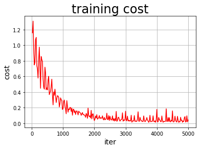
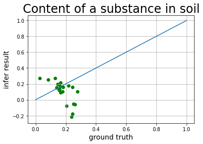

# 基于PaddlePaddle的土壤某物质含量高光谱反演 


## 项目简介

+ 本项目使用遥感卫星拍摄的高光谱数据以及实地采样化验的某物质含量数据来建立一个反演模型

+ 说人话：有模型以后卫星一拍，就能得知土壤中某物质的含量，不用实地采样化验了

+ 高光谱遥感可应用在矿物精细识别（比如油气资源及灾害探测）、地质环境信息反演（比如植被重金属污染探测）、行星地质探测（比如**中国行星探测工程 天问一号**）等

+ 目前有许多模型可用于高光谱反演，如线性模型、自然对数模型、包络线去除模型、简化Hapke模型，人工神经网络模型等，本文选择**线性模型**进行研究，后续更新其他模型

+ 有一个使用keras神经网络模型的代码在我的kaggle主页上可以看到，后续会使用paddlepaddle来实现。

+ [~~作者牛逼，赶紧关注一下~~](https://aistudio.baidu.com/aistudio/personalcenter/thirdview/306432)

##  示意图：  

<div width="100%">
</img>
</img>
</img>
</div>


## 土壤及遥感高光谱相关背景资料
> 土壤是固相、液相、气相三相共存的复杂而异质的体系，其光谱特征极其复杂。许多学者通过测量众多类型的不同质地的大量土壤光谱特征，并根据光谱曲线形状特征、斜率变化以及吸收波段出现与否划分了土壤反射光谱曲线基本类型。 ——[*百度百科-土壤光谱特征* ](https://baike.baidu.com/item/%E5%9C%9F%E5%A3%A4%E5%85%89%E8%B0%B1%E7%89%B9%E5%BE%81/22195372?fr=aladdin)

> 1. 土壤含水量可以用重量含水量，体积含水量等方式表示。传统的获取土壤含水量的方法有：重力法、中子法、伽马射线衰法、张力计等方法。<br>2. 遥感监测土壤含水量可以利用的波段有可见光－近红外、热红外和微波。<br>3. 由于不同含水量的土壤介电特性不同，其回波信号也不同，据此主动微波通过后向散射系数来反演土壤含水量，被动微波利用微波辐射计测得亮度温度，然后通过物理模型或者与土壤含水量建立经验统计关系，反演土壤含水量。<br>4. 在热红外波段，可以利用热惯量法估测土壤含水量。<br>5. 植被指数－地表温度法，利用热红外波段和可见光－近红外波段，通过监测植被长势和地表辐射温度，间接地反映土壤含水量，是一种基于经验参数化的方法。如：作物缺水指数法、温度植被干旱指数法、条件植被指数法、距平植被指数法等。<br>6. 目前普遍认为：对于可见光到短波红外所有波段而言，当土壤含水量低于田间持水量时，土壤反射率随着土壤含水量的增加而降低；而当土壤含水量高于田间持水量时，土壤反射率随着土壤含水量的增加反而增加。<br> *[1] 吴代晖，范闻捷，崔要奎，等. 高光谱遥感监测土壤含水量研究进展[J]. 光谱学与光谱分析. 2010(11): 3067-3071.* 


## 1. 准备数据集

本次使用的数据集是前段时间跟一位博士师哥学习时使用的数据，是师哥辛辛苦苦从各地采样带回实验室化验以及处理遥感图像得来的，例：

| 光谱数据1 | 光谱数据2 | ... | 光谱数据13 | 光谱数据14 |  含量（目标值）  |
| -------- | -------- | -------- | ------- | ------- | ------- |
| 0.189817586  | -0.030734178  | ...  | -1.369184048   | 123 | 0.809584538  |
| 0.143061712  | -0.03534425  | ...  | -1.477681105   | 123 | 0.590777906  |
| 0.695673279  | -0.038891903  | ...   | -1.735026719  | 123 | 0.85  |
| ...  |...  | ...   | ...  | ... | ...  |

目前有许多模型可用于高光谱反演，如线性模型、自然对数模型、包络线去除模型、简化Hapke模型，人工神经网络模型等，本文选择**线性模型**进行研究，后续更新其他模型。  

我们将数据集分割为**两份**：一份用于调整模型的参数，即进行模型的训练，模型在这份数据集上的误差被称为训练误差；另外一份被用来测试，模型在这份数据集上的误差被称为测试误差。我们训练模型的目的是为了通过**从训练数据中找到规律来预测未知的新数据**，所以测试误差是更能反映模型表现的指标。分割数据的比例要考虑到两个因素：更多的训练数据会降低参数估计的方差，从而得到更可信的模型；而更多的测试数据会降低测试误差的方差，从而得到更可信的测试误差。我们这个例子中设置的分割比例为8:2。<kbd>ratio</kbd> 是训练数据所占的比例。


```python
import paddle.fluid as fluid
import paddle
import numpy as np
import os
import matplotlib.pyplot as plt
import pandas as pd
from sklearn.preprocessing import MinMaxScaler
from sklearn.metrics import mean_squared_error


dataset = pd.read_csv('data/data48548/data.csv')#读取数据集
# df转array
values = dataset.values
# 原始数据标准化，为了加速收敛
scaler = MinMaxScaler(feature_range=(0, 1))
scaled = scaler.fit_transform(values)
data = scaled

ratio = 0.8 # 训练集和验证集的划分比例
offset = int(data.shape[0]*ratio)
train_data = data[:offset]
test_data = data[offset:]

def reader_creator(train_data):  
    def reader():  
        for d in train_data:  
            yield d[:-1], d[-1:]  
    return reader


BUF_SIZE=50
BATCH_SIZE=20

#用于训练的数据提供器，每次从缓存中随机读取批次大小的数据
train_reader = paddle.batch(
    paddle.reader.shuffle(reader_creator(train_data), 
                          buf_size=BUF_SIZE),                    
    batch_size=BATCH_SIZE)   
#用于测试的数据提供器，每次从缓存中随机读取批次大小的数据
test_reader = paddle.batch(
    paddle.reader.shuffle(reader_creator(test_data),
                          buf_size=BUF_SIZE),
    batch_size=BATCH_SIZE)  
```

    2020-08-13 13:49:04,134-INFO: font search path ['/opt/conda/envs/python35-paddle120-env/lib/python3.7/site-packages/matplotlib/mpl-data/fonts/ttf', '/opt/conda/envs/python35-paddle120-env/lib/python3.7/site-packages/matplotlib/mpl-data/fonts/afm', '/opt/conda/envs/python35-paddle120-env/lib/python3.7/site-packages/matplotlib/mpl-data/fonts/pdfcorefonts']
    2020-08-13 13:49:04,469-INFO: generated new fontManager


## 2. 配置训练程序
配置训练程序的目的是定义一个训练模型的网络结构。  
对于线性回归来讲，它就是一个从输入到输出的简单的全连接层。训练程序必须返回 <kbd>平均损失</kbd> 作为第一个返回值，因为它会被后面反向传播算法所用到。  
optimizer选择的是 <kbd>SGD optimizer</kbd>，其中 <kbd>learning_rate</kbd> 是学习率，与网络的训练收敛速度有关系。


```python

#定义张量变量x，表示14维的特征值
x = fluid.layers.data(name='x', shape=[14], dtype='float32')
#定义张量y,表示1维的目标值
y = fluid.layers.data(name='y', shape=[1], dtype='float32')
#定义一个简单的线性网络,连接输入和输出的全连接层
#input:输入tensor;
#size:该层输出单元的数目
#act:激活函数
y_predict=fluid.layers.fc(input=x,size=1,act=None)

cost = fluid.layers.square_error_cost(input=y_predict, label=y) #求一个batch的损失值
avg_cost = fluid.layers.mean(cost)  

optimizer = fluid.optimizer.SGDOptimizer(learning_rate=0.001)
opts = optimizer.minimize(avg_cost)

test_program = fluid.default_main_program().clone(for_test=True)

use_cuda = False                         #use_cuda为False,表示运算场所为CPU;use_cuda为True,表示运算场所为GPU           
place = fluid.CUDAPlace(0) if use_cuda else fluid.CPUPlace()
exe = fluid.Executor(place)              #创建一个Executor实例exe
exe.run(fluid.default_startup_program()) #Executor的run()方法执行startup_program(),进行参数初始化

# 定义输入数据维度
feeder = fluid.DataFeeder(place=place, feed_list=[x, y])#feed_list:向模型输入的变量表或变量表名
```

## 3. 开始训练
 <kbd>EPOCH_NUM</kbd> 是训练轮数，<kbd>model_save_dir</kbd> 模型保存目录


```python
EPOCH_NUM=50
model_save_dir = "/home/aistudio/work/fit_a_line.inference.model"

iter=0;
iters=[]
train_costs=[]

def draw_train_process(iters,train_costs):
    title="training cost"
    plt.title(title, fontsize=24)
    plt.xlabel("iter", fontsize=14)
    plt.ylabel("cost", fontsize=14)
    plt.plot(iters, train_costs,color='red',label='training cost') 
    plt.grid()
    plt.show()

for pass_id in range(EPOCH_NUM):                                  #训练EPOCH_NUM轮
    # 开始训练并输出最后一个batch的损失值
    train_cost = 0
    for batch_id, data in enumerate(train_reader()):              #遍历train_reader迭代器
        train_cost = exe.run(program=fluid.default_main_program(),#运行主程序
                             feed=feeder.feed(data),              #喂入一个batch的训练数据，根据feed_list和data提供的信息，将输入数据转成一种特殊的数据结构
                             fetch_list=[avg_cost])    
        if batch_id % 40 == 0:
            print("Pass:%d, Cost:%0.5f" % (pass_id, train_cost[0][0]))    #打印最后一个batch的损失值
        iter=iter+BATCH_SIZE
        iters.append(iter)
        train_costs.append(train_cost[0][0])
       
   
    # 开始测试并输出最后一个batch的损失值
    test_cost = 0
    for batch_id, data in enumerate(test_reader()):               #遍历test_reader迭代器
        test_cost= exe.run(program=test_program, #运行测试cheng
                            feed=feeder.feed(data),               #喂入一个batch的测试数据
                            fetch_list=[avg_cost])                #fetch均方误差
    print('Test:%d, Cost:%0.5f' % (pass_id, test_cost[0][0]))     #打印最后一个batch的损失值
    
    #保存模型
    # 如果保存路径不存在就创建
if not os.path.exists(model_save_dir):
    os.makedirs(model_save_dir)
print ('save models to %s' % (model_save_dir))
#保存训练参数到指定路径中，构建一个专门用预测的program
fluid.io.save_inference_model(model_save_dir,   #保存推理model的路径
                                  ['x'],            #推理（inference）需要 feed 的数据
                                  [y_predict],      #保存推理（inference）结果的 Variables
                                  exe)              #exe 保存 inference model
draw_train_process(iters,train_costs)
```

    Pass:0, Cost:1.15911
    Test:0, Cost:0.35236
    Pass:1, Cost:1.07314
    Test:1, Cost:0.71197
    Pass:2, Cost:0.81184
    Test:2, Cost:0.64363
    Pass:3, Cost:0.81614
    Test:3, Cost:0.30388
    Pass:4, Cost:0.71958
    Test:4, Cost:0.52156
    Pass:5, Cost:0.55596
    Test:5, Cost:0.44431
    Pass:6, Cost:0.47571
    Test:6, Cost:0.19600
    Pass:7, Cost:0.35969
    Test:7, Cost:0.14005
    Pass:8, Cost:0.35448
    Test:8, Cost:0.08732
    Pass:9, Cost:0.32648
    Test:9, Cost:0.14946
    Pass:10, Cost:0.27952
    Test:10, Cost:0.09675
    Pass:11, Cost:0.29099
    Test:11, Cost:0.10573
    Pass:12, Cost:0.20398
    Test:12, Cost:0.04654
    Pass:13, Cost:0.17679
    Test:13, Cost:0.10853
    Pass:14, Cost:0.15204
    Test:14, Cost:0.08020
    Pass:15, Cost:0.14531
    Test:15, Cost:0.03999
    Pass:16, Cost:0.13859
    Test:16, Cost:0.05482
    Pass:17, Cost:0.07771
    Test:17, Cost:0.17297
    Pass:18, Cost:0.09987
    Test:18, Cost:0.01977
    Pass:19, Cost:0.05676
    Test:19, Cost:0.06660
    Pass:20, Cost:0.05553
    Test:20, Cost:0.15458
    Pass:21, Cost:0.06286
    Test:21, Cost:0.07617
    Pass:22, Cost:0.06606
    Test:22, Cost:0.01512
    Pass:23, Cost:0.07603
    Test:23, Cost:0.01894
    Pass:24, Cost:0.04969
    Test:24, Cost:0.10145
    Pass:25, Cost:0.05617
    Test:25, Cost:0.02593
    Pass:26, Cost:0.05966
    Test:26, Cost:0.10495
    Pass:27, Cost:0.02668
    Test:27, Cost:0.08808
    Pass:28, Cost:0.02854
    Test:28, Cost:0.04840
    Pass:29, Cost:0.02824
    Test:29, Cost:0.04153
    Pass:30, Cost:0.03120
    Test:30, Cost:0.00602
    Pass:31, Cost:0.02880
    Test:31, Cost:0.05964
    Pass:32, Cost:0.02900
    Test:32, Cost:0.05765
    Pass:33, Cost:0.03019
    Test:33, Cost:0.05562
    Pass:34, Cost:0.02989
    Test:34, Cost:0.08882
    Pass:35, Cost:0.03201
    Test:35, Cost:0.03831
    Pass:36, Cost:0.02138
    Test:36, Cost:0.03422
    Pass:37, Cost:0.03077
    Test:37, Cost:0.06458
    Pass:38, Cost:0.02235
    Test:38, Cost:0.05606
    Pass:39, Cost:0.02003
    Test:39, Cost:0.03366
    Pass:40, Cost:0.02016
    Test:40, Cost:0.01027
    Pass:41, Cost:0.02222
    Test:41, Cost:0.05839
    Pass:42, Cost:0.02593
    Test:42, Cost:0.05853
    Pass:43, Cost:0.02341
    Test:43, Cost:0.02520
    Pass:44, Cost:0.02260
    Test:44, Cost:0.01256
    Pass:45, Cost:0.02081
    Test:45, Cost:0.06949
    Pass:46, Cost:0.02216
    Test:46, Cost:0.02240
    Pass:47, Cost:0.02446
    Test:47, Cost:0.08049
    Pass:48, Cost:0.01408
    Test:48, Cost:0.03175
    Pass:49, Cost:0.01707
    Test:49, Cost:0.02710
    save models to /home/aistudio/work/fit_a_line.inference.model





## 4. 模型预测
需要构建一个使用训练好的模型来进行预测的程序，训练好的模型位置在 <kbd>model_save_dir</kbd> 。


```python
infer_exe = fluid.Executor(place)    #创建推测用的executor
inference_scope = fluid.core.Scope() #Scope指定作用域

infer_results=[]
groud_truths=[]

#绘制真实值和预测值对比图
def draw_infer_result(groud_truths,infer_results):
    title='Content of a substance in soil'
    plt.title(title, fontsize=24)
    x = np.arange(0,1.5) 
    y = x
    plt.plot(x, y)
    plt.xlabel('ground truth', fontsize=14)
    plt.ylabel('infer result', fontsize=14)
    plt.scatter(groud_truths, infer_results,color='green',label='training cost') 
    plt.grid()
    plt.show()

with fluid.scope_guard(inference_scope):#修改全局/默认作用域（scope）, 运行时中的所有变量都将分配给新的scope。
    #从指定目录中加载 推理model(inference model)
    [inference_program,                             #推理的program
     feed_target_names,                             #需要在推理program中提供数据的变量名称
     fetch_targets] = fluid.io.load_inference_model(#fetch_targets: 推断结果
                                    model_save_dir, #model_save_dir:模型训练路径 
                                    infer_exe)      #infer_exe: 预测用executor
    #获取预测数据
    infer_reader = paddle.batch(reader_creator(test_data),  #测试数据
                          batch_size=20)                           #从测试数据中读取一个大小为20的batch数据
    #从test_reader中分割x
    test_data = next(infer_reader())
    test_x = np.array([data[0] for data in test_data]).astype("float32")
    test_y= np.array([data[1] for data in test_data]).astype("float32")
    results = infer_exe.run(inference_program,                              #预测模型
                            feed={feed_target_names[0]: np.array(test_x)},  #喂入要预测的x值
                            fetch_list=fetch_targets)                       #得到推测结果 
                            
    print("infer results: (Content)")
    for idx, val in enumerate(results[0]):
        print("%d: %.2f" % (idx, val))
        infer_results.append(val)
    print("ground truth:")
    for idx, val in enumerate(test_y):
        print("%d: %.2f" % (idx, val))
        groud_truths.append(val)
    draw_infer_result(groud_truths,infer_results)
```

    infer results: (Content)
    0: 0.25
    1: 0.27
    2: 0.14
    3: -0.05
    4: 0.16
    5: -0.06
    6: -0.22
    7: 0.17
    8: 0.18
    9: 0.21
    10: 0.20
    11: 0.16
    12: 0.11
    13: 0.10
    14: 0.12
    15: 0.09
    16: 0.27
    17: -0.08
    18: 0.15
    19: -0.17
    ground truth:
    0: 0.08
    1: 0.03
    2: 0.16
    3: 0.25
    4: 0.25
    5: 0.26
    6: 0.24
    7: 0.16
    8: 0.22
    9: 0.17
    10: 0.15
    11: 0.18
    12: 0.28
    13: 0.18
    14: 0.15
    15: 0.17
    16: 0.13
    17: 0.20
    18: 0.14
    19: 0.25





## 5. 总结

+ 使用paddlepaddle构建了一个线性模型用于土壤某物质含量高光谱反演  
+ 下一步可以使用神经网络模型
+ [~~作者牛逼，赶紧关注一下~~](https://aistudio.baidu.com/aistudio/personalcenter/thirdview/306432)

## 关于作者

> ## 马云飞  
> 感兴趣的方向为：神经网络在遥感领域的应用 等  
</img>  
> GitHub: <https://github.com/heiheiheiheiheihei>  
> CSDN: <https://me.csdn.net/qq_23305385>  
> bilibili: <https://space.bilibili.com/137012734>  
> kaggle: <https://www.kaggle.com/heiheihei2017>  

 
### 感谢 [学习委员](https://aistudio.baidu.com/aistudio/personalcenter/thirdview/31756) 、 [BIT可达鸭](https://aistudio.baidu.com/aistudio/personalcenter/thirdview/67156) 以及各位老师同学一直以来的支持和指导

## PaddlePaddle简介：
> </img>  
> **PaddlePaddle简介**：PaddlePaddle是源于产业实践的开源深度学习平台。飞桨致力于让深度学习技术的创新与应用更简单<br>
> **PaddlePaddle文档链接**：<https://www.paddlepaddle.org.cn/documentation/docs/zh/beginners_guide/index_cn.html><br>
> **PaddlePaddle官网链接**：<https://www.paddlepaddle.org.cn/><br>
> **Notebook环境基本用法**：<https://ai.baidu.com/docs#/AIStudio_Project_Notebook/a38e5576><br>

